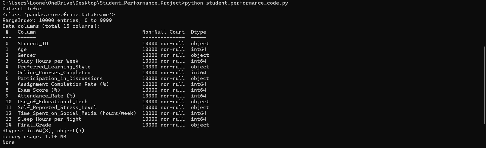
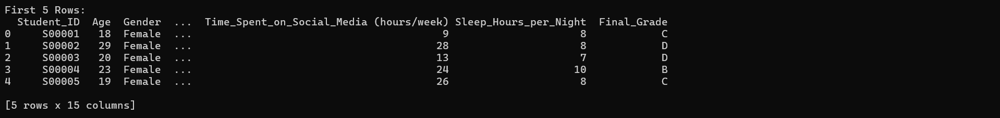
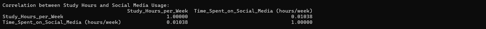
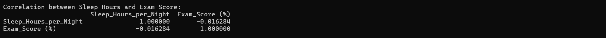
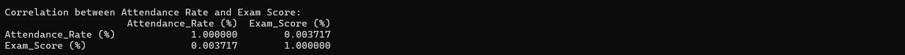
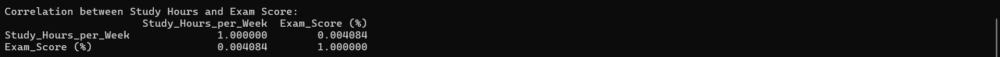
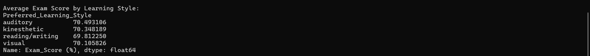
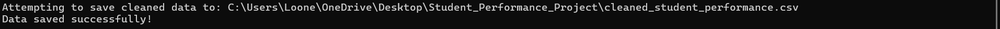

# Student Performance Analysis

## Overview
This project analyzes a dataset of student performance to understand the relationships between various factors (e.g., study hours, sleep hours, attendance, learning style) and exam scores. The goal is to identify which attributes may contribute to better academic performance.

**GitHub Username**: [looneybry](https://github.com/looneybry)

**Repository**: [Student_Performance_Project_PY](https://github.com/looneybry/Student_Performance_Project_PY)

## Tools Used
- **Python**: For data cleaning and analysis.
- **Pandas**: For data manipulation.

## Data Source
The dataset used in this project is available on Kaggle:
- [Student Performance and Learning Style Dataset](https://www.kaggle.com/datasets/adilshamim8/student-performance-and-learning-style)

## Dataset
The dataset contains **10,000 rows** and **15 columns**, including:
- **Student_ID**: Unique identifier for each student.
- **Study_Hours_per_Week**: Number of hours spent studying per week.
- **Sleep_Hours_per_Night**: Average hours of sleep per night.
- **Attendance_Rate (%)**: Percentage of classes attended.
- **Exam_Score (%)**: Student's exam score.
- **Preferred_Learning_Style**: Learning style (e.g., visual, auditory, kinesthetic).
- **Time_Spent_on_Social_Media (hours/week)**: Hours spent on social media per week.
- And more...

## Analysis
### Key Steps:
1. **Data Cleaning**:
   - Handled missing values.
   - Converted percentage columns to numeric.
   - Standardized categorical values (e.g., lowercase for consistency).

2. **Exploratory Data Analysis (EDA)**:
   - Calculated correlations between:
     - Study Hours vs. Social Media Usage.
     - Sleep Hours vs. Exam Score.
     - Attendance Rate vs. Exam Score.
     - Study Hours vs. Exam Score.
   - Grouped analysis:
     - Average exam score by learning style.

### Key Findings:
- **Weak Correlations**: Most factors (e.g., study hours, sleep hours, attendance) showed very weak correlations with exam scores.
- **Learning Style Impact**: Learning style had a minimal impact on exam scores, with auditory learners scoring slightly higher on average.

## Script Output
### Dataset Info


### First 5 Rows


### Correlation Analysis
#### Study Hours vs. Social Media Usage


#### Sleep Hours vs. Exam Score


#### Attendance Rate vs. Exam Score


#### Study Hours vs. Exam Score


### Average Exam Score by Learning Style


### Data Saved Successfully


## How to Use
1. Clone this repository:
   ```bash
   git clone https://github.com/looneybry/Student_Performance_Project_PY.git